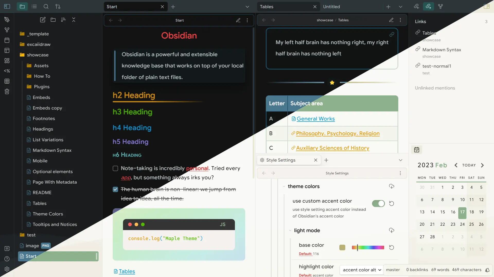
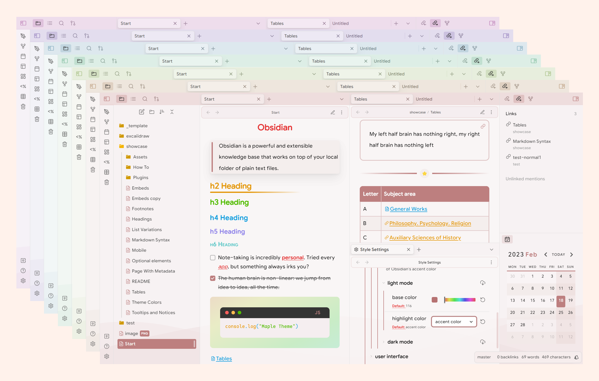
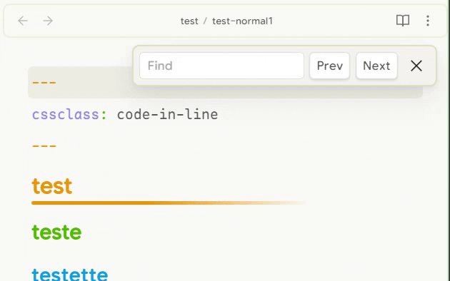
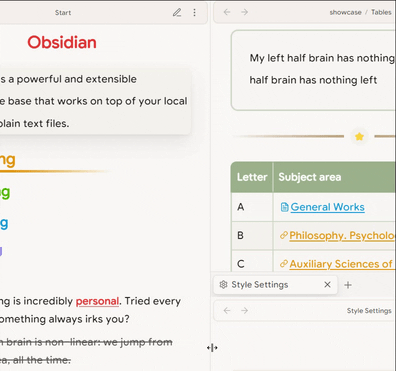
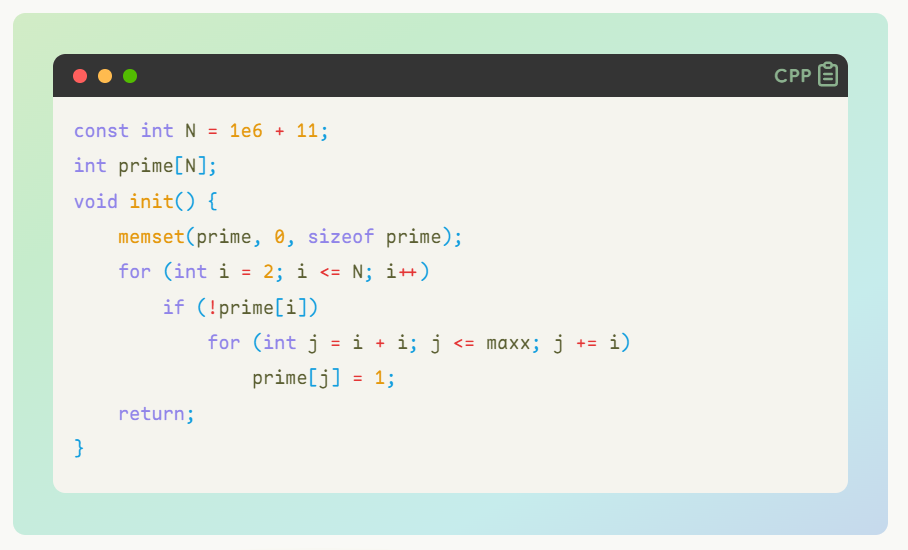
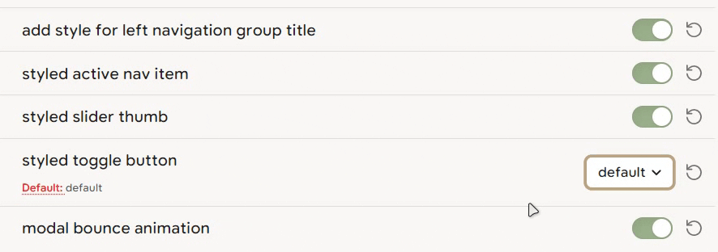
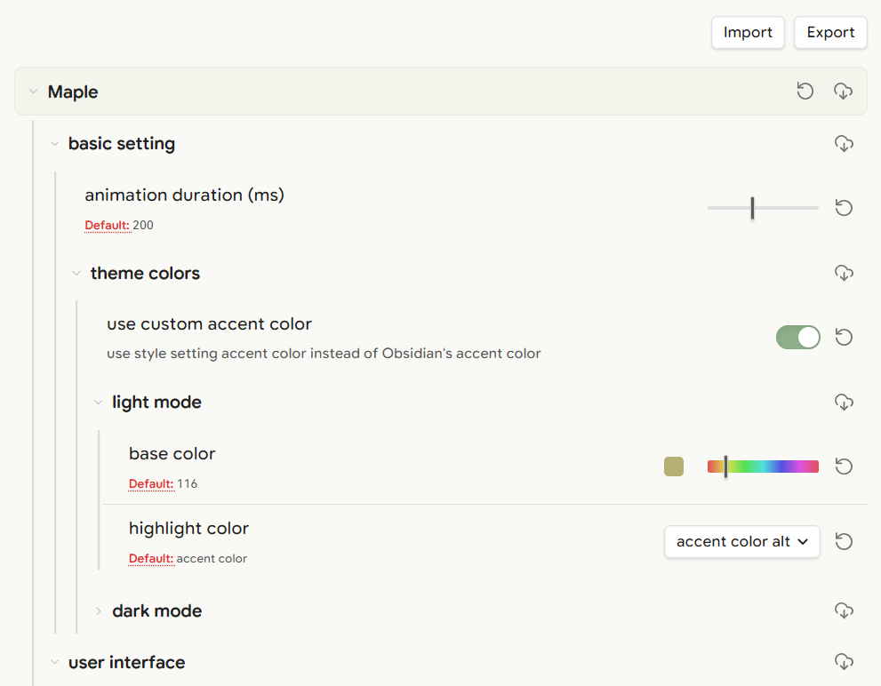

## Maple

an Obsidian theme with some awesome components, using `Style Setting` to custom preference, embed with self-designed monospace font [Maple Mono](https://github.com/subframe7536/Maple-font)

## Getting Started

### Install the Style Settings Plugin (⚠️Required)
1. Open Obsidian and go to Settings.
2. Click on the Community plugins tab.
3. Click on the Browse button.
4. In the Search community plugins... Search Box, search for Style Settings.
5. Click the Install button.
6. Click the Enable button once the plugin is finished installing.

### community store (wait for publish)

1. Install the Prism Theme
2. Open Obsidian and go to Settings.
3. Click on the Appearance tab.
4. Click the Manage button.
5. In the Filter... Search Box, search "Maple".
6. Click the Install and use button.

### manual

1. download theme.css in [project(latest)](./theme.css) or in [release](https://github.com/subframe7536/obsidian-theme-maple/releases)
2. put `theme.css` to `your-vault/.obsidian/snippets`
3. Open Obsidian and go to Settings.
4. Click on the Apparence tab.
5. scroll to the bottom and turn on "theme"

## components

### dynamic theme

dynamic theme with customable accent color

### outline

in outline panel

### document search

### scrollbar style

background color transition and overlay

### code block

### quote

live preview

### toggle button style

### style settings

more options can be configured in Style Settings

## License
MIT