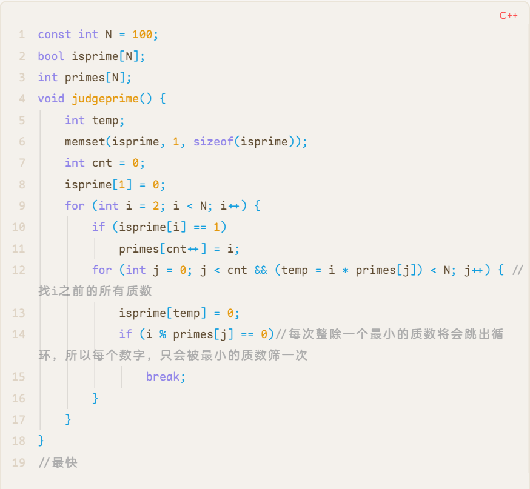
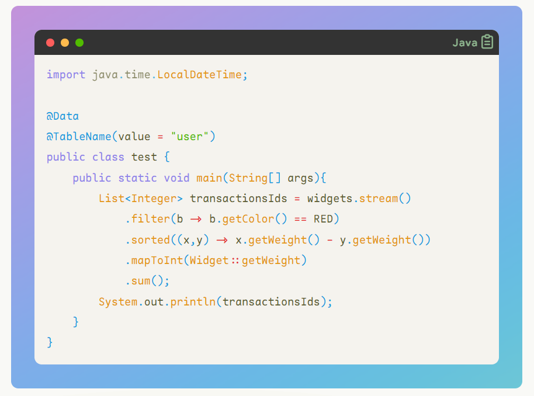

## Maple

an Obsidian theme still in dev, using `Style Setting` to custom preference, embed with self-designed monospace font [Maple Mono](https://github.com/subframe7536/Maple-font)

### usage

put [obsidian.css](https://github.com/subframe7536/obsidian-theme-maple/blob/main/obsidian.css) to `your-vault/.obsidian/snippets` and turn on, highly recommend to use `Style Setting`

# **waiting officially update to electron 21+ for :has() selector**

- codeblock style like [codesnap](https://github.com/kufii/CodeSnap)
- outline style for list

### outline

### code block

