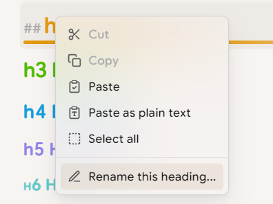
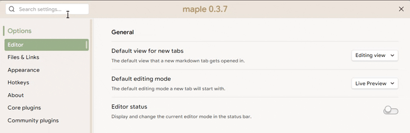

# Maple

an Obsidian theme for desktop with some awesome components, using `Style Setting` to custom preference, embed with self-designed monospace font [Maple Mono](https://github.com/subframe7536/Maple-font)

**does not guarantee backward compatibility due to working time limitations**

## Quick Start

### Install theme

1. Open Obsidian and go to Settings.
2. Click on the Appearance tab.
3. Click on the Manage button to open Community Store.
4. In the Filter... Search Box, search "Maple".
5. Click the Install and use button.

### Customize (⚠️Recommend):

by community plugin: Style Settings

1. Open Obsidian and go to Settings.
2. Click on the Community plugins tab.
3. Click on the Browse button.
4. In the Search community plugins... Search Box, search for Style Settings.
5. Click the Install button.
6. Click the Enable button once the plugin is finished installing.

## Components

### Dynamic theme

dynamic theme with customable accent color

### Outline

in outline panel

### Document search

### Scrollbar style

background color transition and overlay

### Code block

### Quote

live preview

### Toggle button style

### Blur menu

### Modal panel title

### Style settings

**more** options can be configured in Style Settings plugin

## Todo

- [ ] mobile support
- [ ] callouts
- [ ] dataview

### Credit

- [Blue Topaz](https://github.com/whyt-byte/Blue-Topaz_Obsidian-css)
- [Mado Miniflow](https://github.com/hydescarf/Obsidian-Theme-Mado-Miniflow)
- [Border](https://github.com/Akifyss/obsidian-border)

## License

MIT
