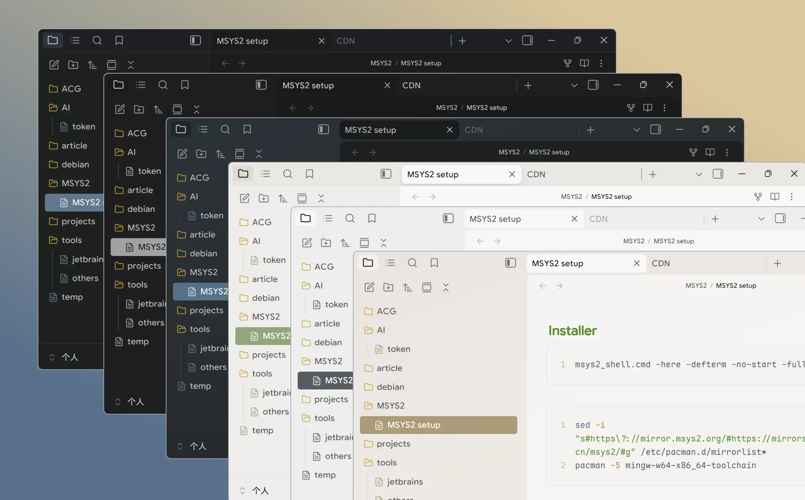
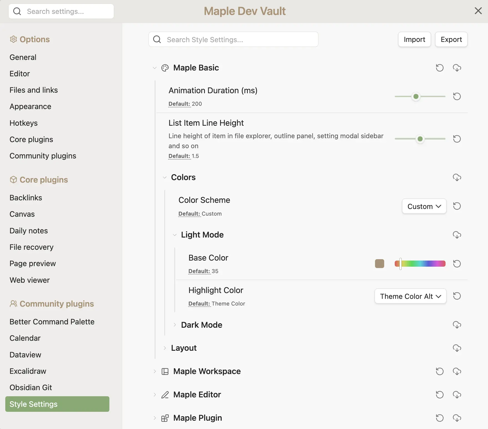
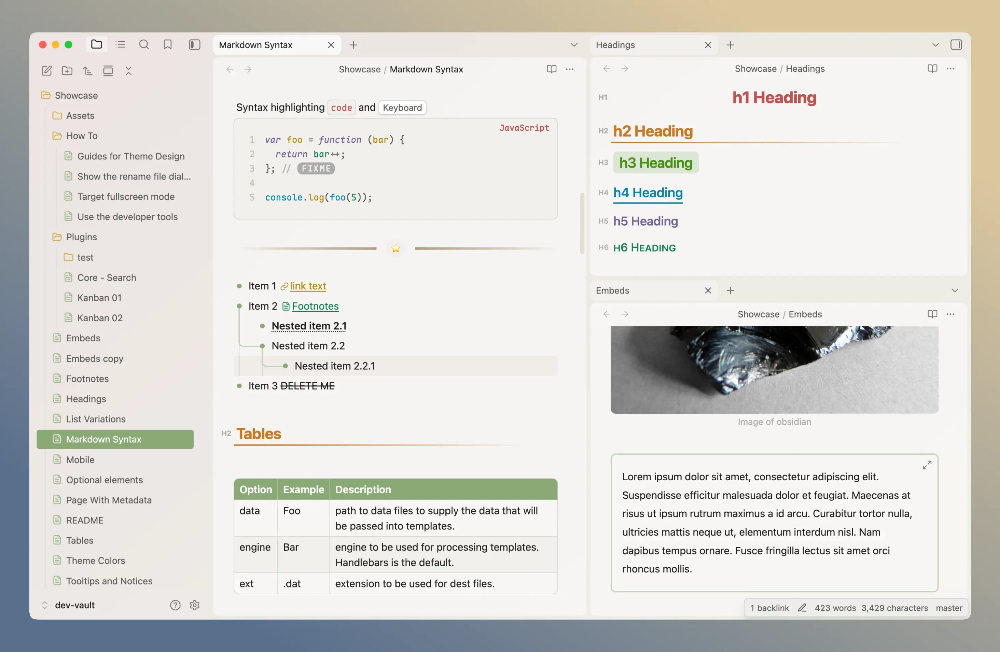
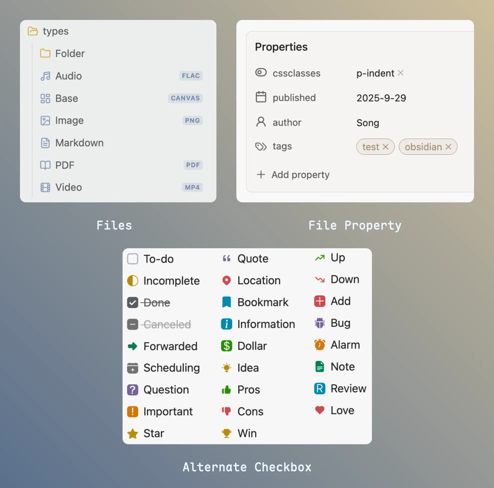
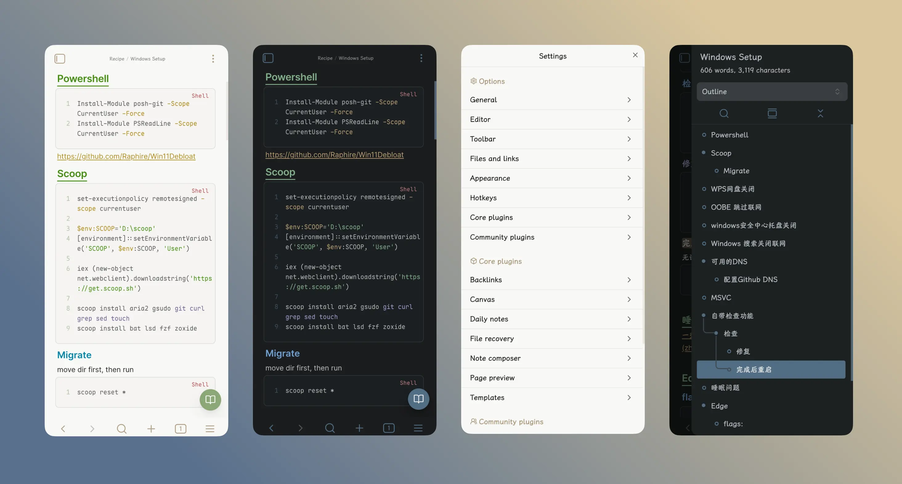

# Maple

[](https://github.com/subframe7536/obsidian-theme-maple)  [](https://github.com/mgmeyers/obsidian-style-settings)

A sleek and modern Obsidian theme for desktop and mobile, featuring awesome components, graceful animation and customizable preferences via the [Style Settings](https://github.com/mgmeyers/obsidian-style-settings) plugin. It embeds the self-designed monospace font [Maple Mono](https://github.com/subframe7536/maple-font).

You can checkout the old version (0.x) [here](https://github.com/subframe7536/obsidian-theme-maple/tree/main).


<a href="https://www.buymeacoffee.com/subframe7536">
  
</a>

Or support me through [Afdian (PayPal)](https://afdian.com/a/subframe7536)

> **Note:** Backward compatibility is not guaranteed due to time constraints.

## Quick Start

### Install

1. Open Obsidian and navigate to **Settings > Appearance**.
2. Click **Manage** to open the Community Themes store.
3. Search for **"Maple"** in the filter box.
4. Click **Install and Enable**.

#### Manually

1. Download the source code zip ([Click to download](https://github.com/subframe7536/obsidian-theme-maple/archive/refs/heads/1.0.zip)).
2. Extract the files to `<your-vault>/.obsidian/themes/maple/` (Ensure the `theme.css` and `manifest.json` are in the `maple/` folder).
3. Restart Obsidian.

### Customize (Recommended) ✨

Enhance your experience with the **Style Settings** community plugin:

1. Go to **Settings > Options > Community plugins**
2. Ensure **community plugins** option is turning on, then click **Browse** button.
3. Search for **"Style Settings"** and install it.
4. Enable the plugin.
5. In **Settings > Community plugins > Style Settings**, you'll find Maple's style options.

## Features

Maple offers a highly customizable experience with extensive options via Style Settings. Below is a summary of key features, grouped by category.

### Your Flavor Matters

Maple is designed to be highly customizable, allowing you to tailor the theme to your liking. You can change the color scheme, layout, app background, and more.




### Enhance the Experience

Maple includes awesome components and graceful animations throughout—tab switches, hovers, modals, card layout, colorful table and heading, tree list and scrollbars—for a fluid workflow.



Plenty of **new icons** are designed to promote the visual experience. Also, Maple has first-class support of **Alternate Checkbox**.



#### Alternate Checkbox Syntax

| Syntax  | Description |
| ------- | ----------- |
| `- [ ]` | To-do       |
| `- [/]` | Incomplete  |
| `- [x]` | Done        |
| `- [-]` | Canceled    |
| `- [>]` | Forwarded   |
| `- [<]` | Scheduling  |
| `- [?]` | Question    |
| `- [!]` | Important   |
| `- [*]` | Star        |
| `- ["]` | Quote       |
| `- [l]` | Location    |
| `- [b]` | Bookmark    |
| `- [i]` | Information |
| `- [S]` | Dollar      |
| `- [I]` | Idea        |
| `- [p]` | Pros        |
| `- [c]` | Cons        |
| `- [w]` | Win         |
| `- [u]` | Up          |
| `- [d]` | Down        |
| `- [+]` | Add         |
| `- [B]` | Bug         |
| `- [a]` | Alarm       |
| `- [n]` | Note        |
| `- [R]` | Review      |
| `- [L]` | Love        |

### Optimized for Mobile

Maple is optimized for Obsidian on mobile devices, ensuring a seamless experience across different screen sizes. But everything just getting started, I will keep working on it.



## Override Colors

Ensure you have the Style Settings plugin installed and enabled to access these options.

### Override Background Colors

1. Open **Settings > Style Settings**.
2. Open the **Maple Basic > Colors** section.
3. Ensure **Color Scheme** is set to **Custom**.
4. Open **Light Mode** or **Dark Mode** section
5. Turn on **Modify Background Colors** switch.
6. Change the Primary/Secondary/Block/TopBar colors as you like.

#### Experimental Change Highlight Color Only

Enable `Only change highlight color` and all background color will restore to default theme.

It is still experimental and not fully tested, feel free to report bug about this option.

### Override Highlight Colors

1. Open **Settings > Style Settings**.
2. Open the **Maple Basic > Colors** section.
3. Ensure **Color Scheme** is set to **Custom**.
4. Open **Light Mode** or **Dark Mode** section
5. Set **Highlight Colors** to **Custom**.
6. Change the Active/Inactive colors as you like.

## Development

Please ensure [`Bun`](https://bun.sh) is installed.

```sh
# Install deps
bun i

# Dev and hot reload
bun run dev

# Build product
bun run build

# Release
bun run release
```

Fonts, svgs are located at `resource/` and icons come from `iconify-json` packages. They will auto load at compile time. See usage in [`src/custom-functions.ts`](src/custom-functions.ts)

Style settings config is auto generated by the script, see [`compile.ts`](compile.ts) and [`src/style-settings/`](src/style-settings)

## Credits

Inspired by:

- [Minimal](https://github.com/kepano/obsidian-minimal)
- [Blue Topaz](https://github.com/whyt-byte/Blue-Topaz_Obsidian-css)
- [Border](https://github.com/Akifyss/obsidian-border)
- [Cupertino](https://github.com/aaaaalexis/obsidian-cupertino/)
- [Baseline](https://github.com/aaaaalexis/obsidian-baseline)
- [Velocity](https://github.com/Gonzalo-D-Sales/obsidian-velocity)

Enhance your DX with my plugin: [Obsidian DevTools Font and Scrollbar](https://github.com/subframe7536/obsidian-devtools-font-and-scrollbar)

## License

[MIT License](LICENSE)
