# Maple

A sleek and modern Obsidian theme for desktop and mobile, featuring awesome components and customizable preferences via the [Style Settings](https://github.com/mgmeyers/obsidian-style-settings) plugin. It includes the self-designed monospace font [Maple Mono](https://github.com/subframe7536/maple-font).

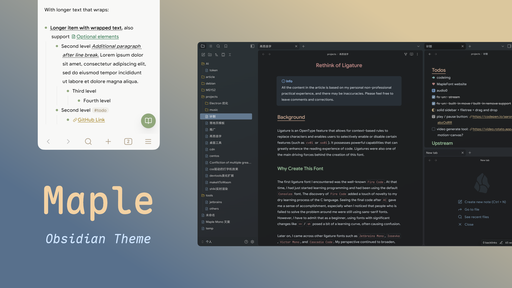

> **Note:** Backward compatibility is not guaranteed due to time constraints.

## Table of Contents

- [Quick Start](#quick-start)
- [Components](#components)
- [Todo](#todo)
- [Credits](#credits)
- [License](#license)

## Quick Start

### Install the Theme

1. Open Obsidian and navigate to **Settings > Appearance**.
2. Click **Manage** to open the Community Themes store.
3. Search for **"Maple"** in the filter box.
4. Click **Install and Enable**.

### Customize (Recommended) ✨

Enhance your experience with the **Style Settings** community plugin:

1. Go to **Settings > Community Plugins > Browse**.
2. Search for **"Style Settings"** and install it.
3. Enable the plugin.
4. In **Settings > Appearance > CSS snippets**, you'll find Maple's style options.

## Components

### Dynamic Theme

Supports dynamic theming with customizable accent colors.

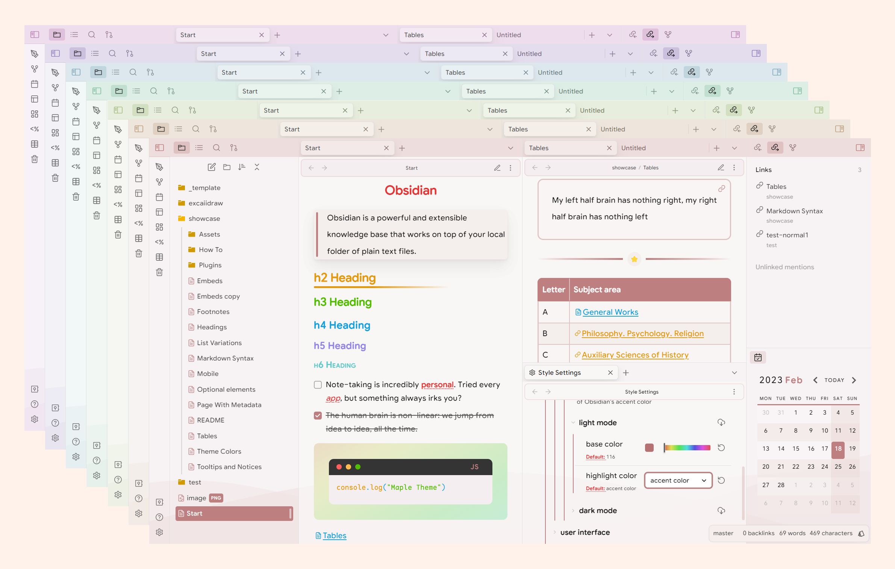

### Outline Panel

Enhanced styling for the outline view.

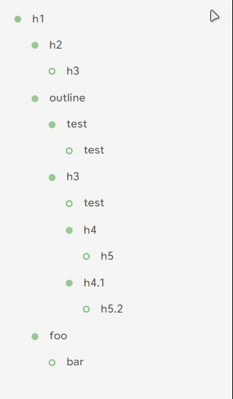

### Document Search

Modern container query-based search interface.

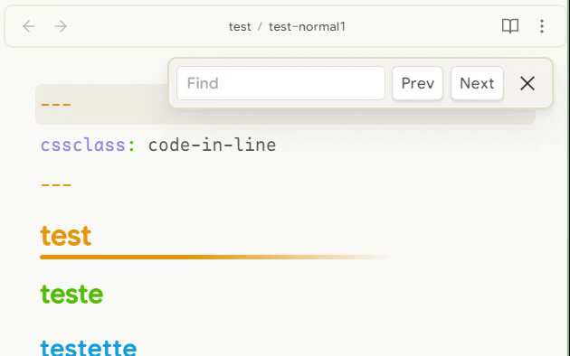

### Scrollbar

Smooth background transitions and overlay effects.

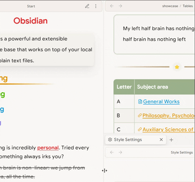

### Code Blocks

Beautiful syntax highlighting and presentation.

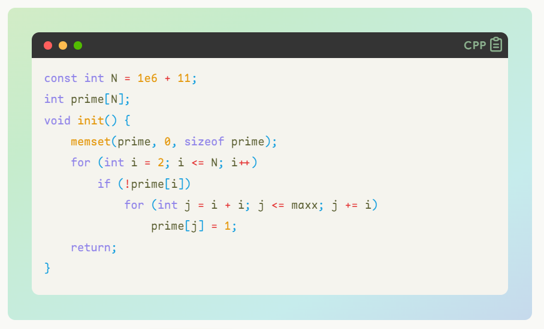

### Quotes

Live preview enhancements for blockquotes.

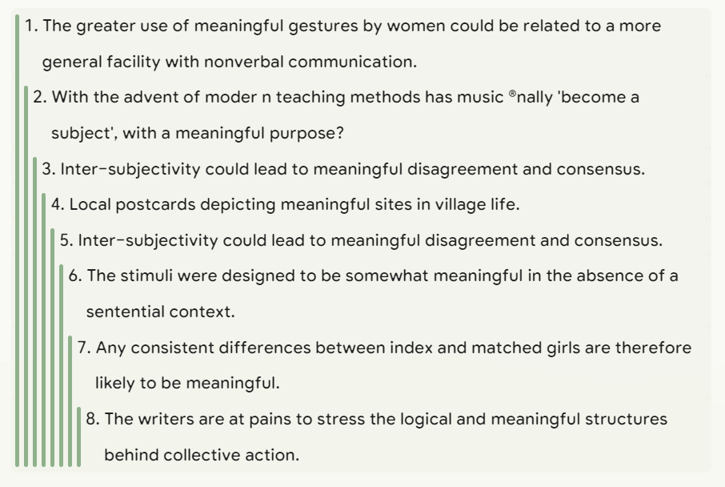

### Toggle Buttons

Interactive and visually appealing toggles.

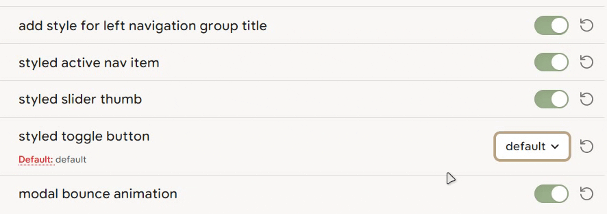

### Blur Effects

Subtle blur on menus and overlays.

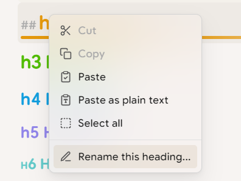

### Modal Inputs

Improved title and input styling in modals.

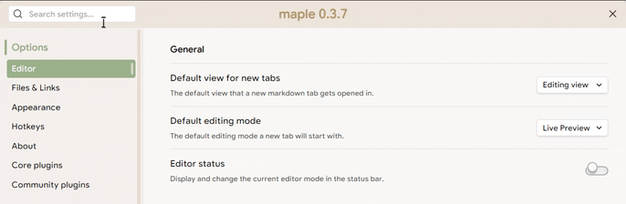

### Style Settings

Extensive customization options available in the Style Settings plugin.

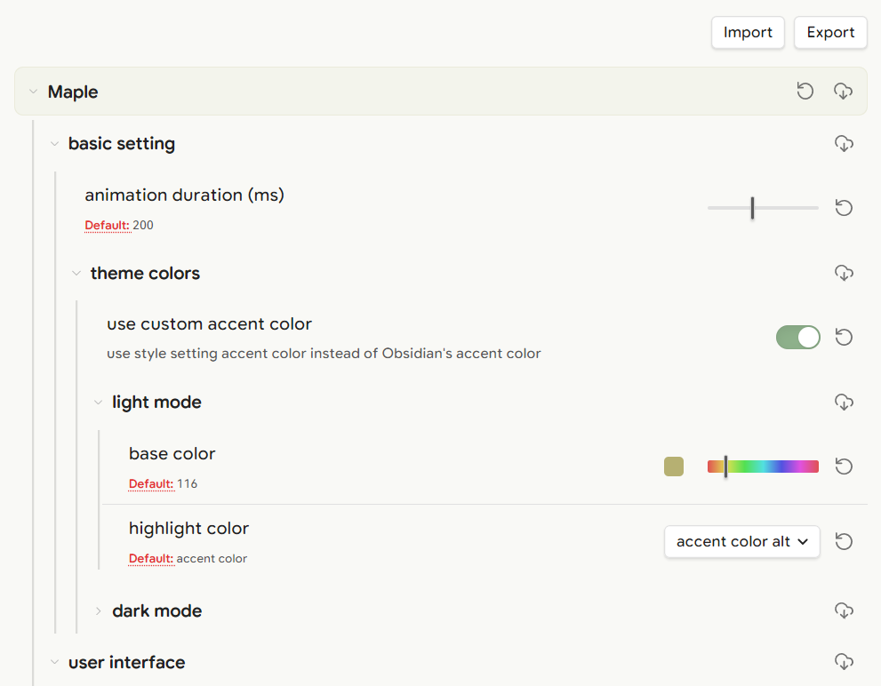

## Credits

Inspired by:
- [Blue Topaz](https://github.com/whyt-byte/Blue-Topaz_Obsidian-css)
- [Mado Miniflow](https://github.com/hydescarf/Obsidian-Theme-Mado-Miniflow)
- [Border](https://github.com/Akifyss/obsidian-border)
- [Cupertino](https://github.com/aaaaalexis/obsidian-cupertino/)
- [Baseline](https://github.com/aaaaalexis/obsidian-baseline)
- [Velocity](https://github.com/Gonzalo-D-Sales/obsidian-velocity)

Enhance your DX on Windows with my plugin: [Obsidian DevTools Font and Scrollbar](https://github.com/subframe7536/obsidian-devtools-font-and-scrollbar)

## License

[MIT License](LICENSE)
